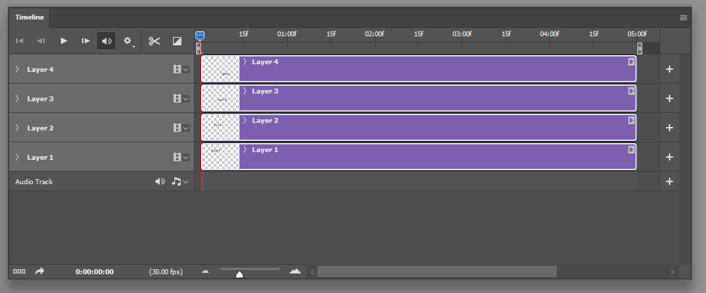

# Photoshop Timeline Layer Resizer

Photoshop script that lets you resize and reposition multiple layers on
a Photoshop animation timeline, including the ability to stagger the position
of each resized layer.



## Installation

 Download the script by right-clicking [here](https://raw.githubusercontent.com/horshack-dpreview/Photoshop-Timeline-Layer-Resizer/master/Photoshop%20Timeline%20Layer%20Resizer.jsx) and choosing "Save Link As..."

## Using the Script
1. Select the layer(s) in your timeline you want to change the duration of.
2. If you also want to reposition+stagger the resized layers, move the
   playhead to where you want the first layer to begin.
3. Run this script in Photoshop via File -> Scripts -> Browse...
4. This script will prompt you to enter the new duration in seconds and frames
   for the selected layers and also ask if you'd like to reposition+stagger
   the layers.

For faster access to the script (via Photoshop's script menu), copy the script
to Photoshop's script folder. Example location of the folder on Windows is
C:\Program Files\Adobe\Adobe Photoshop 2021\Presets\Scripts. Restart PS, after
which the script can be run via File -> Scripts -> Photoshop Timeline Layer
Resizer

For even faster access, you can create a keyboard shortcut to the script.
First copy the script to the PS script folder as instructed above and restart
PS. Then open the Actions panel and click + to create a new action. Assign an
available shortkey key and name the action, then press "Record". Click the
hamburger menu in the Action panel (small icon with four horizontal lines) and
click "Insert Menu Item...". While the "Insert Menu Item" window is open, go
to File -> Scripts -> Photoshop Timeline Layer Resizer. Then press OK on the
"Insert Menu Item" dialog. Press the square stop button in the Action panel to
complete the action recording. You can now access the script with the shortcut
key you assigned to it.


Layer stagger example:

Before:
```
x <- Playhead
x
x[Layer 1]
x[Layer 2]
x[Layer 3]
```
After:
```
x <- Playhead
x
x[Layer 1]
x         [Layer 2]
x                  [Layer 3]
```
